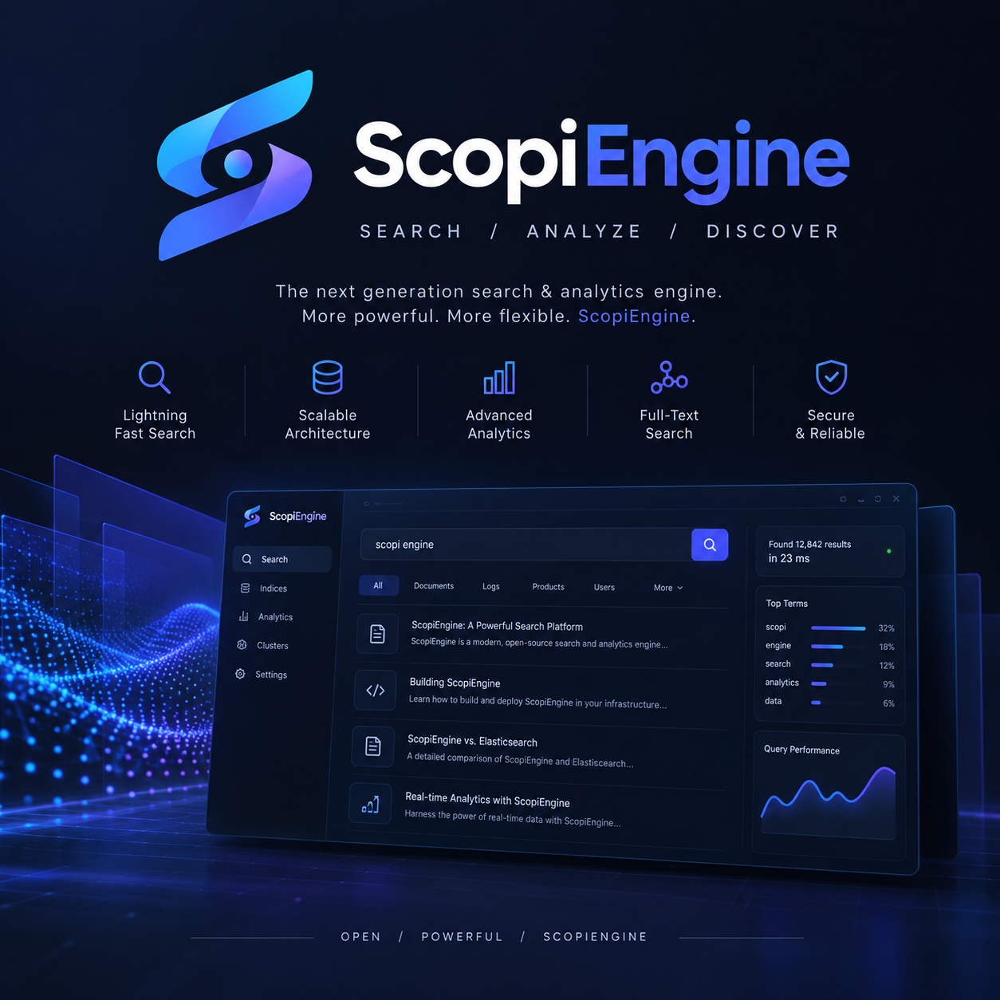
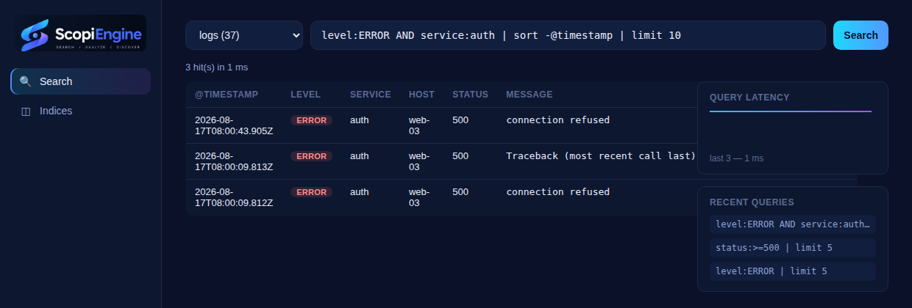

<p align="center">
  
</p>

<h1 align="center">ScopiEngine</h1>

<p align="center"><strong>Search / Analyze / Discover</strong></p>

<p align="center">
  A search &amp; analytics engine that keeps the Elasticsearch mental model
  and throws away the parts that make it painful.
</p>

<p align="center">
  <a href="LICENSE"></a>
  
  
</p>

<p align="center">
  
</p>

---

## What it is

ScopiEngine speaks the vocabulary you already know — indices, mappings, documents,
analyzers, a query DSL, aggregations, `_bulk`, a REST API — but it is a single
`pip install`, runs on CPython with no JVM, and its query surface is designed to be
typed by a human rather than generated by a client library.

## Quickstart

```bash
pip install scopiengine

scopi index create logs

printf '%s\n' \
  '{"@timestamp": "2026-08-17T08:00:09Z", "level": "ERROR", "service": "auth", "message": "connection refused"}' \
  '{"@timestamp": "2026-08-17T08:00:19Z", "level": "INFO", "service": "auth", "message": "login succeeded"}' \
  > app.log

scopi ingest file app.log --index logs --processor json_line
scopi search logs 'level:ERROR AND service:auth | sort -@timestamp | limit 10'
```

A larger, realistic example — an explicit mapping and a matching sample log
file — lives at [`examples/mappings/logs.json`](examples/mappings/logs.json)
and [`examples/logs/sample-app.log`](examples/logs/sample-app.log):

```bash
scopi index create logs2 --mapping examples/mappings/logs.json
scopi ingest file examples/logs/sample-app.log --index logs2 --processor json_line
scopi search logs2 'status:>=500 | stats count() by service'
```

## Web UI

`scopi serve` also serves a minimal web UI at `/_ui/` — an index picker, a
ScopiQL search box, and a results table, backed by the same REST endpoints
above. No separate install, no build step: it's plain static files bundled
with the package. A login can be required for it (off by default) — see
[docs/UI_AUTH.md](docs/UI_AUTH.md).

<p align="center">
  
</p>

## Why it exists

| Friction in the usual stack | What ScopiEngine does |
|---|---|
| A JVM, a heap to tune, gigabytes of RSS before the first document | Pure Python, `pip install`, starts in a second |
| Verbose JSON for a query you could say in eight characters | **ScopiQL** — `level:ERROR \| sort -@timestamp \| limit 10` |
| Storage is the engine; you take what you are given | Pluggable `StorageBackend` — SQLite by default, **MS SQL Server** first-class |
| Plugins mean a JVM classpath and a matching engine build | Ordinary Python packages found through entry points |
| Shipping big log files in reliably is somebody else's problem | Resilient streaming ingestion: byte-offset checkpoints, crash resume, rotation handling, bounded memory |

The ES-shaped JSON DSL still works, so existing tooling keeps functioning while you
migrate to the shorter syntax.

## ScopiEngine vs. Elasticsearch

An honest comparison, not a marketing one — ScopiEngine is a single-node,
single-process engine; it does not attempt to be a drop-in Elasticsearch
replacement at scale.

| | ScopiEngine 1.0.0 | Elasticsearch |
|---|---|---|
| Runtime | Pure Python (CPython 3.11/3.12), `pip install` | JVM, a heap to size and tune |
| Startup / footprint | Starts in ~1s, tens of MB RSS | JVM warmup, typically ≥1 GB heap recommended |
| Query surface | **ScopiQL** (compact string syntax) and a JSON DSL subset (see below) | Query DSL, EQL, SQL, ES\|QL |
| Storage backends | Pluggable `StorageBackend`: SQLite (built in), MS SQL Server (`[mssql]` extra); `mongodb://` registered but unavailable until 1.1 | Lucene segments on local/network-attached disk only |
| Distribution | **None** — single node, single process, no sharding or replication | Sharding, replication, multi-node clusters |
| Aggregations | `terms` bucket aggregation only | Full aggregation framework (metric, bucket, pipeline) |
| Text analysis | `standard`/`whitespace`/`keyword`/`pattern`/`log` tokenizers, common filters, no stemming (ships as a reference plugin in 1.1) | Extensive built-in and pluggable analyzers, including stemmers, ICU, synonyms |
| Ingestion | Built-in resilient file ingestion: chunked reads, checkpointed resume, rotation handling, bounded memory | Beats/Logstash/ingest pipelines, generally separate processes |
| Plugin model | Ordinary installable Python packages, discovered via `importlib.metadata` entry points or `SCOPI_PLUGINS` | JVM plugins, matched to a specific ES build |
| API shape | REST API with Elasticsearch-shaped requests/responses for the supported surface, plus a first-class CLI that drives the engine in process | REST API, no bundled CLI query tool |
| Security | None built in (no auth, no TLS termination) — put a reverse proxy in front | Built-in auth, TLS, RBAC (some behind a license tier) |
| Maturity / ecosystem | New, single-maintainer project | Mature, large ecosystem, wide production track record |

Use ScopiEngine when you want the Elasticsearch mental model for a single
node's worth of logs without a JVM or a cluster to operate. Use Elasticsearch
when you need distribution, mature aggregations, or its broader plugin and
tooling ecosystem.

## ES DSL compatibility, in brief

The JSON DSL is a **deliberate subset** of Elasticsearch's query DSL — every
clause or option not listed as supported raises `UnsupportedFeatureError`
naming the exact key, rather than being silently ignored.

| Supported | Not supported (1.0) |
|---|---|
| `match_all`, `match`, `match_phrase`, `term`, `terms`, `prefix`, `range`, `exists`, `bool` (`must`/`should`/`must_not`/`filter`) | `multi_match`, `query_string`, `simple_query_string`, `wildcard`, `regexp`, `fuzzy`, `span_*`, `nested`, `has_child`/`has_parent`, `geo_*`, `script`, `function_score`, `dis_max`, `intervals` |
| `from`/`size`, `sort` (a genuine index-wide sort, not page-local), `_source`, `aggs`/`aggregations` (`terms` only) | `highlight`, `collapse`, `search_after`, `pit`, `runtime_mappings`, `rescore`, `suggest`, metric/pipeline aggregations, `date_histogram` |

`hits.total.value` is always the true, uncapped match count — there is no
`track_total_hits` knob because nothing needs opting into. See
[docs/QUERY_LANGUAGE.md](docs/QUERY_LANGUAGE.md#json-dsl-compatibility-matrix)
for the full clause-by-clause matrix, worked examples, and the ScopiQL grammar.

## Handling large log files

Ingestion is built for files that do not fit in memory. It reads in fixed chunks,
never materialises the file, holds a hard RSS ceiling through a bounded queue, and
commits the byte offset **inside the same transaction** as the documents it indexed —
so a `kill -9` mid-ingest resumes at exactly the last durable record, with no
duplicates and no gap.

```bash
scopi ingest file huge.log --index logs --follow      # tail, survives rotation
# kill -9 at any point, then:
scopi ingest file huge.log --index logs --resume      # picks up exactly where it stopped
```

## Documentation

| Document | Contents |
|---|---|
| [docs/INSTALL.md](docs/INSTALL.md) | Installation, Docker, storage setup |
| [docs/USAGE.md](docs/USAGE.md) | CLI and REST walkthrough |
| [docs/QUERY_LANGUAGE.md](docs/QUERY_LANGUAGE.md) | ScopiQL grammar and the ES DSL compatibility matrix |
| [docs/INGEST.md](docs/INGEST.md) | Large-file ingestion, checkpoints, tuning |
| [docs/STORAGE_BACKENDS.md](docs/STORAGE_BACKENDS.md) | SQLite, MS SQL Server, writing a backend |
| [docs/PLUGINS.md](docs/PLUGINS.md) | Hook points and writing a plugin |
| [docs/ARCHITECTURE.md](docs/ARCHITECTURE.md) | Segments, postings codec, scoring |
| [docs/UI_AUTH.md](docs/UI_AUTH.md) | Web UI login: Service Accounts, sessions, scope |

## Status

Version 1.0.0 is a single-node engine. Distribution (sharding, replication),
the full aggregation framework, and remote ingest sources are on the roadmap —
see [CHANGELOG.md](CHANGELOG.md).

## License

MIT — see [LICENSE](LICENSE). Copyright (c) 2026 Alperen CK.
